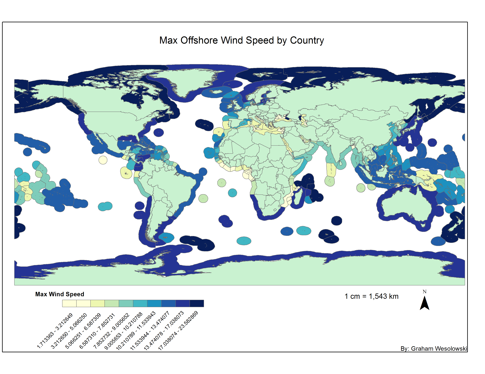

# Lab 2

## Python Script

## Country Max Wind Production

## Summary of Top Countries

The top 3 countries by MEAN offshore wind speed were:

1. [kereguelen Islands]
2. [Southern Kuriles]
3. [St. Pierre and Miquelon]

The top 3 countries by MAX offshore wind speed were:

1. [Russia]
1. [Mauritis]
1. [Southern Kuriles]
